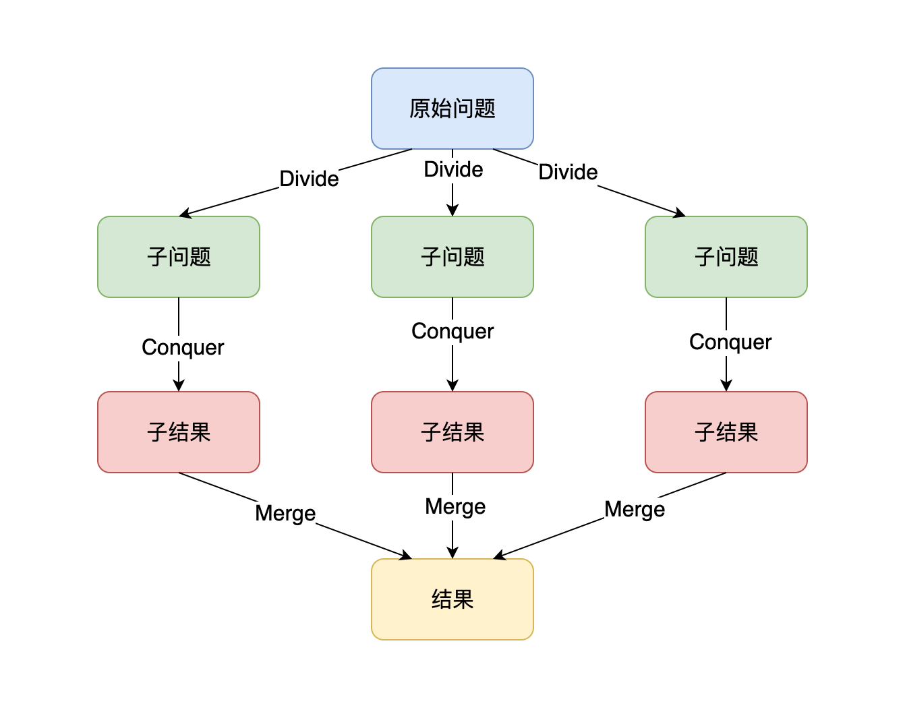
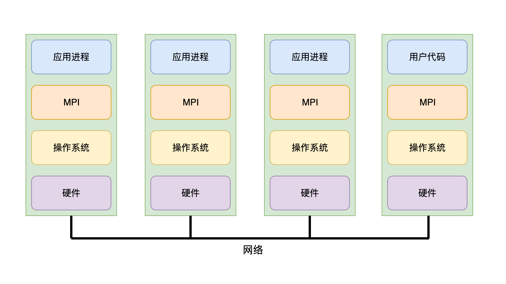
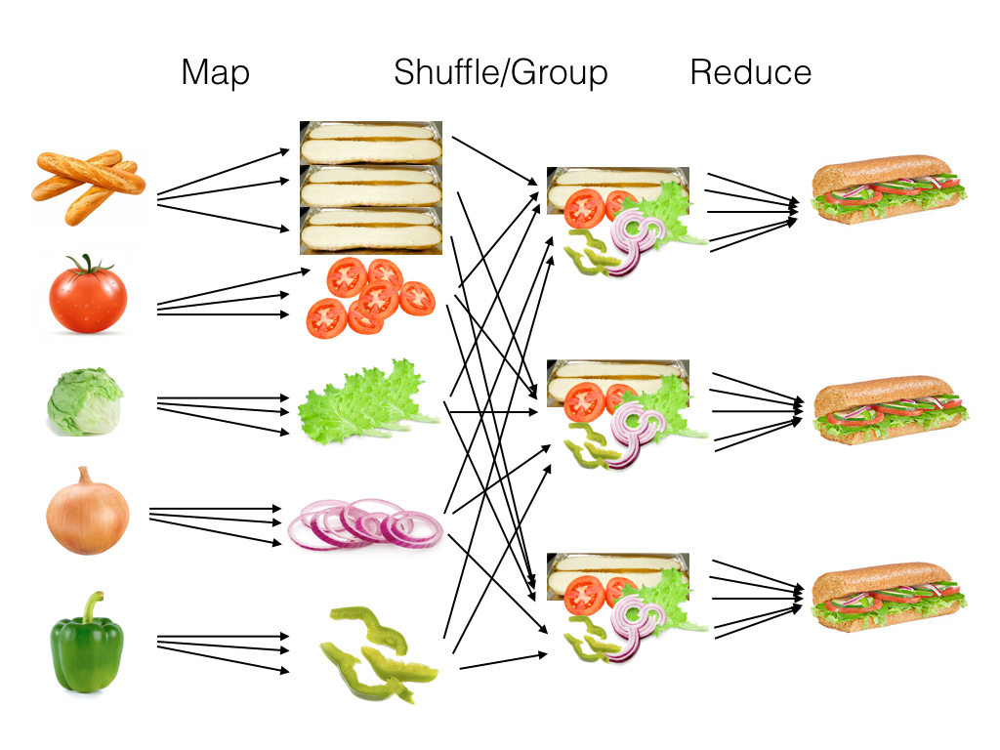

(bigdata)=
# 什么是大数据

## 1.1.1 大数据的5个“V”

大数据，顾名思义，就是拥有庞大体量的数据。关于什么是大数据、如何定义大数据、如何使用大数据等一系列问题，拥有不同领域背景的读者的理解各不相同。通常，业界将大数据的特点归纳为图1-1所示的5个“V”。

- **Volume**：指数据量大。数据量单位从TB（1 024 GB）、PB（1 024 TB）、EB（1 024 PB）、ZB（1 024 EB）甚至到YB（1 024 ZB）。纽约证券交易所每天产生的交易数据大约在TB级，瑞士日内瓦附近的大型强子对撞机每年产生的数据约为PB级，而目前全球数据总量已经在ZB级，相当于1 000 000 PB。基于更大规模的数据，我们可以对某个研究对象的历史、现状和未来有更加全面的了解。
- **Velocity**：指数据产生速度快。数据要求的处理速度更快和时效性更强，因为时间就是金钱。金融市场的交易数据必须以秒级的速度进行处理，搜索和推荐引擎需要以分钟级速度将实时新闻推送给用户。更快的数据处理速度可让我们基于最新的数据做出更加实时的决策。
- **Variety**：指数据类型繁多。数据可以是数字、文字、图片、视频等不同的形式，数据源可能是社交网络、视频网站、可穿戴设备以及各类传感器。数据可能是Excel表格等高度结构化的数据，也可能是图片和视频等非结构化的数据。
- **Veracity**：指数据真实性。一方面，数据并非天然具有高价值，一些异常值会被掺杂进来，例如，统计偏差、人的情感因素、天气因素、经济因素甚至谎报数据等导致的异常值。另一方面，数据源类型不同，如何将来自多样的数据源的多元异构数据连接、匹配、清洗和转化，最终形成具有真实性的数据是一项非常有挑战性的工作。
- **Value**：指数据价值。大数据已经推动了世界的方方面面的发展，从商业、科技到医疗、教育、经济、人文等社会的各个领域，我们研究和利用大数据的最终目的是挖掘数据背后的深层价值。

在数据分析领域，全部研究对象被称为总体（Population），总体包含大量的数据，数据甚至可能是无限的。很多情况下，我们无法保证能收集和分析总体的所有数据，因此研究者一般基于全部研究对象的一个子集进行数据分析。样本（Sample）是从总体中抽取的个体，是全部研究对象的子集。通过对样本的调查和分析，研究者可以推测总体的情况。比如调查某个群体的金融诚信情况，群体内所有人是总体，我们可以抽取一部分个体作为样本，以此推测群体的金融诚信水平。

在大数据技术成熟之前，受限于数据收集、存储和分析能力，样本数量相对较小。大数据技术的成熟让数据存储和计算能力不再是瓶颈，研究者可以在更大规模的数据上，以更快的速度进行数据分析。但数据并非天然有价值，如何对数据“点石成金”非常有挑战性。在金融诚信调查中，如果我们直接询问样本对象，“你是否谎报了家庭资产以获取更大的金融借贷额度？”十之八九，我们得不到真实的答案，但我们可以结合多种渠道的数据来分析该问题，比如结合样本对象的工作经历、征信记录等数据。

大数据具有更大的数据量、更快的速度、更多的数据类型等特点。在一定的数据真实性基础上，大数据技术最终要为数据背后的价值服务。

随着大数据技术的发展，数据的复杂性越来越高，有人在这5个“V”的基础上，又提出了一些补充内容，比如增加了动态性（Vitality），强调整个数据体系的动态性；增加了可视性（Visualization），强调数据的显性化展现；增加了合法性（Validity），强调数据采集和应用的合法性，特别是对于个人隐私数据的合理使用等；增加了数据在线（Online），强调数据永远在线，能随时被调用和计算。

## 1.1.2 大数据分而治之

计算机诞生之后，一般是在单台计算机上处理数据。大数据时代到来后，一些传统的数据处理方法无法满足大数据的处理需求。将一组计算机组织到一起形成一个集群，利用集群的力量来处理大数据的工程实践逐渐成为主流。这种使用集群进行计算的方式被称为分布式计算，当前几乎所有的大数据系统都在使用集群进行分布式计算。

分布式计算的概念听起来很高深，其背后的思想却十分朴素，即分而治之，又称为分治法（Divide and Conquer）。如图1-2所示，分治法是指将一个原始问题分解为多个子问题，多个子问题分别在多台计算机上求解，借助必要的数据交换和合并策略，将子结果汇总即可求出最终结果的方法。具体而言，不同的分布式系统使用的算法和策略根据所要解决的问题各有不同，但基本上都是将计算拆分，把子问题放到多台计算机上，分而治之地计算求解。分布式计算的每台计算机（物理机或虚拟机）又被称为一个节点。

分布式计算已经有很多比较成熟的方案，其中比较有名的有消息传递接口（Message Passing Interface，MPI）和映射归约模型（MapReduce）。

### 1. MPI

MPI是一个“老牌”分布式计算框架，从MPI这个名字也可以看出，MPI主要解决节点间数据通信的问题。在前MapReduce时代，MPI是分布式计算的业界标准。MPI现在依然广泛运用于全球各大超级计算中心、大学、研究机构中，许多物理、生物、化学、能源等基础学科的大规模分布式计算都依赖MPI。图1-3所示为使用MPI在4台服务器上并行计算的示意图。

使用MPI编程，需要使用分治法将问题分解成子问题，在不同节点上分而治之地求解。MPI提供了一个在多进程、多节点间进行数据通信的方案，因为绝大多数情况下，在中间求解和最终汇总的过程中，需要对多个节点上的数据进行交换和同步。

MPI中最重要的两个操作为数据发送和数据接收，数据发送表示将本进程中某些数据发送给其他进程，数据接收表示接收其他进程的数据。在实际的代码开发过程中，程序员需要自行设计分治算法，将复杂问题分解为子问题，手动调用MPI库，将数据发送给指定的进程。

MPI能够以很细的粒度控制数据的通信，这是它的优势，从某些方面而言这也是它的劣势，因为细粒度的控制意味着从分治算法设计、数据通信到结果汇总都需要程序员手动控制。有经验的程序员可以对程序进行底层优化，取得成倍的速度提升。但如果程序员对计算机分布式系统没有太多经验，编码、调试和运行MPI程序的时间成本极高，加上数据在不同节点上分布不均衡和通信延迟等问题，一个节点进程失败将会导致整个程序失败。因此，MPI对大部分程序员来说简直就是“噩梦”。

并非所有的程序员都能熟练掌握MPI编程，衡量一个程序的时间成本，不仅要考虑程序运行的时间，也要考虑程序员学习、开发和调试的时间。就像C语言运算速度极快，但是Python却更受欢迎一样，MPI虽然能提供极快的分布式计算速度，但不太接地气。

### 2. MapReduce

为了解决分布式计算学习和使用成本高的问题，研究人员开发出了更简单易用的MapReduce编程模型。MapReduce是Google于2004年推出的一种编程模型，与MPI将所有事情交给程序员控制不同，MapReduce编程模型只需要程序员定义两个操作：Map和Reduce。

比起MPI，MapReduce编程模型将更多的中间过程做了封装，程序员只需要将原始问题转化为更高层次的应用程序接口（Application Programming Interface，API），至于原始问题如何分解为更小的子问题、中间数据如何传输和交换、如何将计算扩展到多个节点等一系列细节问题可以交给大数据编程模型来解决。因此，MapReduce相对来说学习门槛更低，使用更方便，编程开发速度更快。

图1-4所示为使用MapReduce思想制作三明治的过程，读者可以通过这幅图更好的理解MapReduce。

假设我们需要大批量地制作三明治，三明治的每种食材可以分别单独处理，Map阶段将原材料在不同的节点上分别进行处理，生成一些中间食材，Shuffle/Group阶段将不同的中间食材进行组合，Reduce阶段最终将一组中间食材组合成三明治成品。可以看到，这种Map + Shuffle/Group + Reduce的方式就是分治法的一种实现。

基于MapReduce编程模型，不同的团队分别实现了自己的大数据框架：Hadoop是较早的一种开源实现，如今已经成为大数据领域的业界标杆，之后又出现了Spark和Flink。这些框架提供了编程接口，辅助程序员存储、处理和分析大数据。

1.1.1 小节介绍了大数据的5个“V”特点，1.1.2 小节介绍了大数据的分治法。面对海量数据和各不相同的业务逻辑，我们很难使用一种技术或一套方案来解决各类大数据问题。比如，电商平台和视频网站的大数据架构会略有不同。实际上，大数据技术是一整套方案，包括存储、计算和提供在线服务等多个重要部分，而且与数据形态、业务逻辑、提供何种价值等多方面的因素有关。

与大数据有关联的组件众多、技术各有不同，限于本书主题和编者能力，无法一一阐述，本书主要从计算层面来介绍大数据的分析和处理方法。
