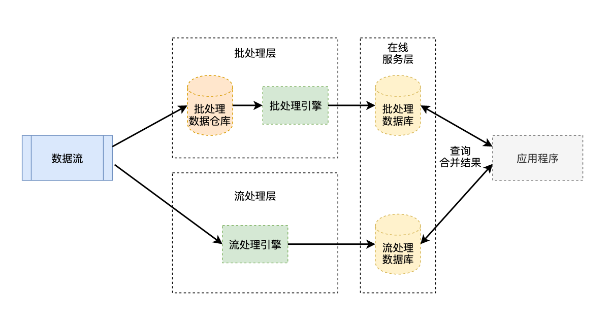
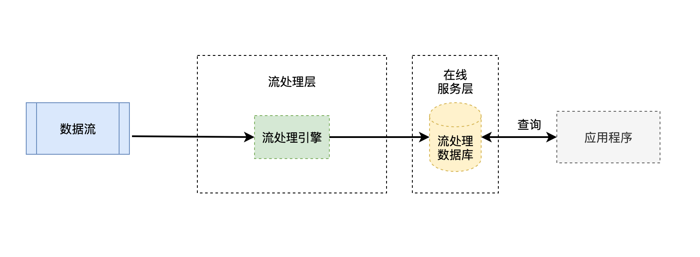

(evolution-of-big-data-processing-platforms)=
# 从Lambda到Kappa：大数据处理平台的演进

前文已经提到，流处理框架经历了3代的更新迭代，大数据处理也随之经历了从Lambda架构到Kappa架构的演进。本节以电商平台的数据分析为例，来解释大数据处理平台如何支持企业在线服务。电商平台会将用户在App或网页的搜索、点击和购买行为以日志的形式记录下来，用户的各类行为形成了一个实时数据流，我们称之为用户行为日志。

## 1.4.1 Lambda架构

当以 Storm 为代表的第一代流处理框架成熟后，一些互联网公司为了兼顾数据的实时性和准确性，采用图1-12所示的Lambda架构来处理数据并提供在线服务。Lambda架构主要分为3部分：批处理层、流处理层和在线服务层。其中数据流来自Kafka这样的消息队列。

1. **批处理层**
   在批处理层，数据流首先会被持久化保存到批处理数据仓库中，积累一段时间后，再使用批处理引擎来进行计算。这个积累时间可以是一小时、一天，也可以是一个月。处理结果最后导入一个可供在线应用系统查询的数据库上。批处理层中的批处理数据仓库可以是HDFS、Amazon S3或其他数据仓库，批处理引擎可以是MapReduce或Spark。

   假如电商平台的数据分析部门想查看全网某天哪些商品购买次数最多，可使用批处理引擎对该天数据进行计算。像淘宝、京东这种级别的电商平台，用户行为日志数据量非常大，在这份日志上进行一个非常简单的计算都可能需要几个小时。批处理引擎一般会定时启动，对前一天或前几个小时的数据进行处理，将结果输出到一个数据库中。与动辄几个小时的批处理的处理时间相比，直接查询一个在线数据库中的数据只需要几毫秒。使用批处理生成一个预处理结果，将结果输出到在线服务层的数据库中，是很多企业仍在采用的办法。

   这里计算购买次数的例子相对比较简单，在实际的业务场景中，一般需要做更为复杂的统计分析或机器学习计算，比如构建用户画像时，根据用户年龄和性别等人口统计学信息，分析某类用户最有可能购买的是哪类商品，这类计算耗时更长。

   批处理层能保证某份数据的结果的准确性，而且即使程序运行失败，直接重启即可。此外，批处理引擎一般扩展性好，即使数据量增多，也可以通过增加节点数量来横向扩展。

2. **流处理层**
   很明显，假如整个系统只有一个批处理层，会导致用户必须等待很久才能获取计算结果，一般有几个小时的延迟。电商数据分析部门只能查看前一天的统计分析结果，无法获取当前的结果，这对实时决策来说是一个巨大的时间鸿沟，很可能导致管理者错过最佳决策时机。因此，在批处理层的基础上，Lambda架构增加了一个流处理层，用户行为日志会实时流入流处理层，流处理引擎生成预处理结果，并导入一个数据库。分析人员可以查看前一小时或前几分钟内的数据结果，这大大增强了整个系统的实时性。但数据流会有事件乱序等问题，使用早期的流处理引擎，只能得到一个近似准确的计算结果，相当于牺牲了一定的准确性来换取实时性。

   1.3.4小节曾提到，早期的流处理引擎有一些缺点，由于准确性、扩展性和容错性的不足，流处理层无法直接取代批处理层，只能给用户提供一个近似结果，还不能为用户提供一个一致准确的结果。因此Lambda架构中，出现了批处理和流处理并存的现象。

3. **在线服务层**
   在线服务层直接面向用户的特定请求，需要将来自批处理层准确但有延迟的预处理结果和流处理层实时但不够准确的预处理结果做融合。在融合过程中，需要不断将流处理层的实时数据覆盖批处理层的旧数据。很多数据分析工具在数据合并上下了不少功夫，如Apache Druid，它可以融合流处理与批处理结果。当然，我们也可以在应用程序中人为控制预处理结果的融合。存储预处理结果的数据库可能是关系型数据库MySQL，也可能是Key-Value键值数据库Redis或HBase。

4. **Lambda架构的优缺点**
   Lambda架构在实时性和准确性之间做了一个平衡，能够解决很多大数据处理的问题，它的优点如下：
    - 批处理的准确度较高，而且在数据探索阶段可以对某份数据试用不同的方法，反复对数据进行实验。另外，批处理的容错性和扩展性较强。
    - 流处理的实时性较强，可以提供一个近似准确的结果。

   Lambda架构的缺点也比较明显，如下：
    - 使用两套大数据处理引擎，如果两套大数据处理引擎的API不同，有任何逻辑上的改动，就需要在两边同步更新，维护成本高，后期迭代的时间周期长。
    - 早期流处理层的结果只是近似准确。

## 1.4.2 Kappa架构

Kafka的创始人杰•克雷普斯认为在很多场景下，维护一套Lambda架构的大数据处理平台耗时耗力，于是提出在某些场景下，没有必要维护一个批处理层，直接使用一个流处理层即可满足需求，即图1-13所示的Kappa架构。

Kappa架构的兴起主要有如下两个原因：
- Kafka可以保存更长时间的历史数据，它不仅起到消息队列的作用，也可以存储数据，替代数据库。
- Flink流处理引擎解决了事件乱序下计算结果的准确性问题。

Kappa架构相对更简单，实时性更好，所需的计算资源远小于Lambda架构，随着实时处理的需求的不断增长，更多的企业开始使用Kappa架构。

Kappa架构的流行并不意味着不再需要批处理，批处理在一些特定场景上仍然有自己的优势。比如，进行一些数据探索、机器学习实验，需要使用批处理来反复验证不同的算法。Kappa架构适用于一些逻辑固定的数据预处理流程，比如统计一个时间段内商品的曝光和购买次数、某些关键词的搜索次数等，这类数据处理需求已经固定，无须反复试验迭代。

Flink以流处理见长，但也实现了批处理的API，是一个集流处理与批处理于一体的大数据处理引擎，为Kappa架构提供更可靠的数据处理性能，未来Kappa架构将在更多场景下逐渐替换Lambda架构。

