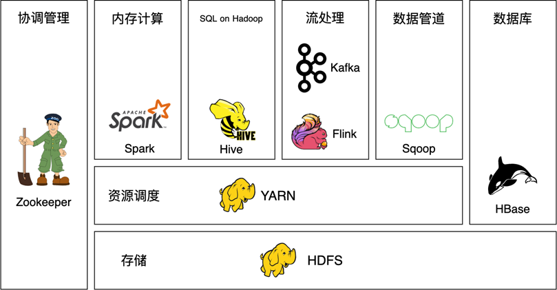
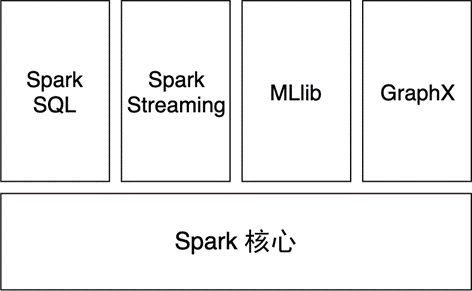
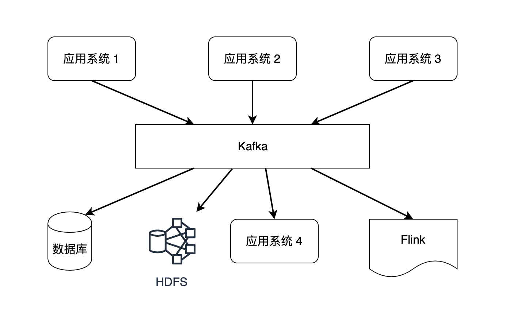

(representative-big-data-technologies)=
# 代表性大数据技术

MapReduce编程模型的提出为大数据分析和处理开创了一条先河，其后涌现出一批知名的开源大数据技术，本节主要对一些流行的技术和框架进行简单介绍。

## 1.3.1  Hadoop

2004年，Hadoop的创始人道格·卡廷（Doug Cutting）和麦克·卡法雷拉（Mike Cafarella）受MapReduce编程模型和Google File System等技术的启发，对其中提及的思想进行了编程实现，Hadoop的名字来源于道格·卡廷儿子的玩具大象。由于道格·卡廷后来加入了雅虎，并在雅虎工作期间做了大量Hadoop的研发工作，因此Hadoop也经常被认为是雅虎开源的一款大数据框架。时至今日，Hadoop不仅是整个大数据领域的先行者和领航者，更形成了一套围绕Hadoop的生态圈，Hadoop和它的生态圈是绝大多数企业首选的大数据解决方案。图1-7展示了Hadoop生态圈一些流行组件。

Hadoop生态圈的核心组件主要有如下3个。

- **Hadoop MapReduce**：Hadoop版本的MapReduce编程模型，可以处理海量数据，主要面向批处理。
- **HDFS**：HDFS（Hadoop Distributed File System）是Hadoop提供的分布式文件系统，有很好的扩展性和容错性，为海量数据提供存储支持。
- **YARN**：YARN（Yet Another Resource Negotiator）是Hadoop生态圈中的资源调度器，可以管理一个Hadoop集群，并为各种类型的大数据任务分配计算资源。

这三大组件中，数据存储在HDFS上，由MapReduce负责计算，YARN负责集群的资源管理。除了三大核心组件，Hadoop生态圈还有很多其他著名的组件，部分如下。

- **Hive**：借助Hive，用户可以编写结构化查询语言（Structured Query Language，SQL）语句来查询HDFS上的结构化数据，SQL语句会被转化成MapReduce运行。
- **HBase**：HDFS可以存储海量数据，但访问和查询速度比较慢，HBase可以提供给用户毫秒级的实时查询服务，它是一个基于HDFS的分布式数据库。HBase最初受Google Bigtable技术的启发。
- **Kafka**：Kafka是一款流处理框架，主要用作消息队列。
- **ZooKeeper**：Hadoop生态圈中很多组件使用动物来命名，形成了一个大型“动物园”，ZooKeeper是这个动物园的管理者，主要负责分布式环境的协调。

## 1.3.2  Spark

2009年，Spark诞生于加州大学伯克利分校，2013年被捐献给Apache基金会。实际上，Spark的创始团队本来是为了开发集群管理框架Apache Mesos（以下简称Mesos）的，其功能类似YARN，Mesos开发完成后，需要一个基于Mesos的产品运行在上面以验证Mesos的各种功能，于是他们接着开发了Spark。Spark有火花、鼓舞之意，创始团队希望用Spark来证明在Mesos上从零开始创造一个项目非常简单。

Spark是一款大数据处理框架，其开发初衷是改良Hadoop MapReduce的编程模型和提高运行速度，尤其是提升大数据在机器学习方向上的性能。与Hadoop相比，Spark的改进主要有如下两点。

- **易用性**：MapReduce模型比MPI更友好，但仍然不够方便。因为并不是所有计算任务都可以被简单拆分成Map和Reduce，有可能为了解决一个问题，要设计多个MapReduce任务，任务之间相互依赖，整个程序非常复杂，导致代码的可读性和可维护性差。Spark提供更加方便易用的接口，提供Java、Scala、Python和R语言等的API，支持SQL、机器学习和图计算，覆盖了绝大多数计算场景。
- **速度快**：Hadoop的Map和Reduce的中间结果都需要存储到磁盘上，而Spark尽量将大部分计算放在内存中。加上Spark有向无环图的优化，在官方的基准测试中，Spark比Hadoop快一百倍以上。

Spark的核心在于计算，主要目的在于优化Hadoop MapReduce计算部分，在计算层面提供更细致的服务。

Spark并不能完全取代Hadoop，实际上，从图1-7可以看出，Spark融入了Hadoop生态圈，成为其中的重要一员。一个Spark任务很可能依赖HDFS上的数据，向YARN申请计算资源，将结果输出到HBase上。当然，Spark也可以不用依赖这些组件，独立地完成计算。

Spark主要面向批处理需求，因其优异的性能和易用的接口，Spark已经是批处理界绝对的“王者”。Spark的子模块Spark Streaming提供了流处理的功能，它的流处理主要基于mini-batch的思想。如图1-9所示，Spark Streaming将输入数据流切分成多个批次，每个批次使用批处理的方式进行计算。因此，Spark是一款集批处理和流处理于一体的处理框架。

## 1.3.3  Apache Kafka

2010年，LinkedIn开始了其内部流处理框架的开发，2011年将该框架捐献给了Apache基金会，取名Apache Kafka（以下简称Kafka）。Kafka的创始人杰·克雷普斯（Jay Kreps）觉得这个框架主要用于优化读写，应该用一个作家的名字来命名，加上他很喜欢作家卡夫卡的文学作品，觉得这个名字对一个开源项目来说很酷，因此取名Kafka。

Kafka也是一种面向大数据领域的消息队列框架。在大数据生态圈中，Hadoop的HDFS或Amazon S3提供数据存储服务，Hadoop MapReduce、Spark和Flink负责计算，Kafka常常用来连接不同的应用系统。

如图1-10所示，企业中不同的应用系统作为数据生产者会产生大量数据流，这些数据流还需要进入不同的数据消费者，Kafka起到数据集成和系统解耦的作用。系统解耦是让某个应用系统专注于一个目标，以降低整个系统的维护难度。在实践上，一个企业经常拆分出很多不同的应用系统，系统之间需要建立数据流管道（Stream Pipeline）。假如没有Kafka的消息队列，M个生产者和N个消费者之间要建立M×N个点对点的数据流管道，Kafka就像一个中介，让数据管道的个数变为M+N，大大减小了数据流管道的复杂程度。

从批处理和流处理的角度来讲，数据流经Kafka后会持续不断地写入HDFS，积累一段时间后可提供给后续的批处理任务，同时数据流也可以直接流入Flink，被用于流处理。

随着流处理的兴起，Kafka不甘心只做一个数据流管道，开始向轻量级流处理方向努力，但相比Spark和Flink这样的计算框架，Kafka的主要功能侧重在消息队列上。

## 1.3.4  Flink

Flink是由德国3所大学发起的的学术项目，后来不断发展壮大，并于2014年年末成为Apache顶级项目之一。在德语中，“flink”表示快速、敏捷，以此来表征这款计算框架的特点。

Flink主要面向流处理，如果说Spark是批处理界的“王者”，那么Flink就是流处理领域冉冉升起的“新星”。流处理并不是一项全新的技术，在Flink之前，不乏流处理引擎，比较著名的有Storm、Spark Streaming，图1-11展示了流处理框架经历的三代演进。

2011年成熟的Apache Strom（以下简称Storm）是第一代被广泛采用的流处理引擎。它是以数据流中的事件为最小单位来进行计算的。以事件为单位的框架的优势是延迟非常低，可以提供毫秒级的延迟。流处理结果依赖事件到达的时序准确性，Storm并不能保障处理结果的一致性和准确性。Storm只支持至少一次（At-Least-Once）和至多一次（At-Most-Once），即数据流里的事件投递只能保证至少一次或至多一次，不能保证只有一次（Exactly-Once）。在多项基准测试中，Storm的数据吞吐量和延迟都远逊于Flink。对于很多对数据准确性要求较高的应用，Storm有一定劣势。此外，Storm不支持SQL，不支持中间状态（State）。

图1-11 流处理框架演进

2013年成熟的Spark Streaming是第二代被广泛采用的流处理框架。1.3.2小节中提到，Spark是“一统江湖”的大数据处理框架，Spark Streaming采用微批次（mini-batch）的思想，将数据流切分成一个个小批次，一个小批次里包含多个事件，以接近实时处理的效果。这种做法保证了“Exactly-Once”的事件投递效果，因为假如某次计算出现故障，重新进行该次计算即可。Spark Streaming的API相比第一代流处理框架更加方便易用，与Spark批处理集成度较高，因此Spark可以给用户提供一个流处理与批处理一体的体验。但因为Spark Streaming以批次为单位，每次计算一小批数据，比起以事件为单位的框架来说，延迟从毫秒级变为秒级。

与前两代引擎不同，在2015年前后逐渐成熟的Flink是一个支持在有界和无界数据流上做有状态计算的大数据处理框架。它以事件为单位，支持SQL、状态、水位线（Watermark）等特性，支持“Exactly-Once”。比起Storm，它的吞吐量更高，延迟更低，准确性能得到保障；比起Spark Streaming，它以事件为单位，达到真正意义上的实时计算，且所需计算资源相对更少。具体而言，Flink的优点如下。

- 支持事件时间（Event Time）和处理时间（Processing Time）多种时间语义。即使事件乱序到达，Event Time也能提供准确和一致的计算结果。Procerssing Time适用于对延迟敏感的应用。
- Exactly-Once投递保障。
- 毫秒级延迟。
- 可以扩展到上千台节点、在阿里巴巴等大公司的生产环境中进行过验证。
- 易用且多样的API，包括核心的DataStream API和DataSet API以及Table API和SQL。
- 可以连接大数据生态圈各类组件，包括Kafka、Elasticsearch、JDBC、HDFS和Amazon S3。可以运行在Kubernetes、YARN、Mesos和独立（Standalone）集群上。