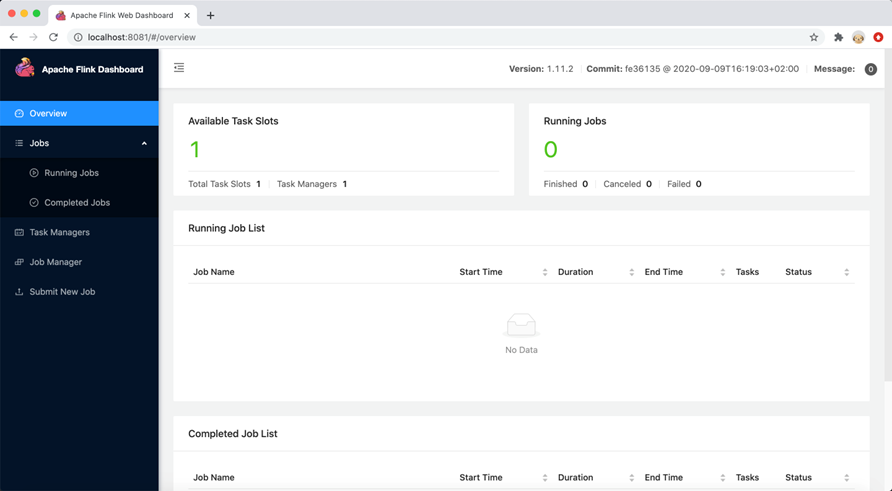
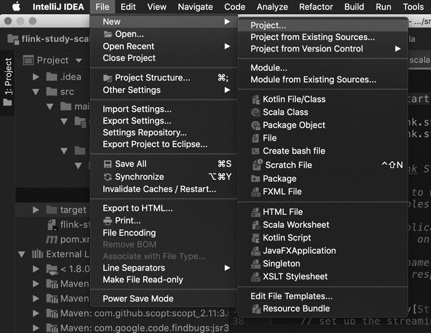
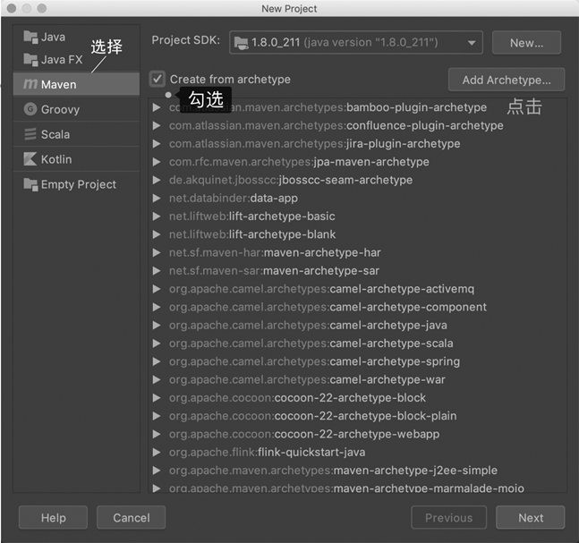
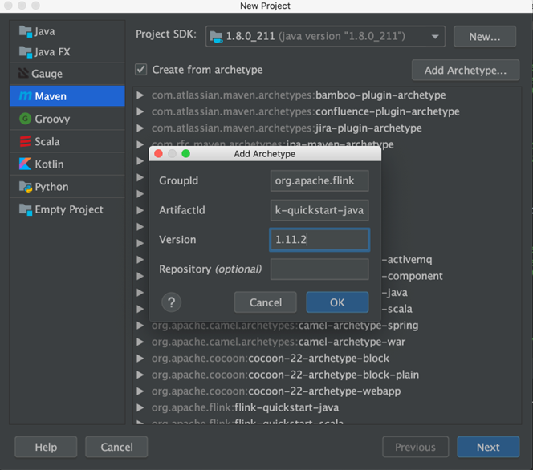
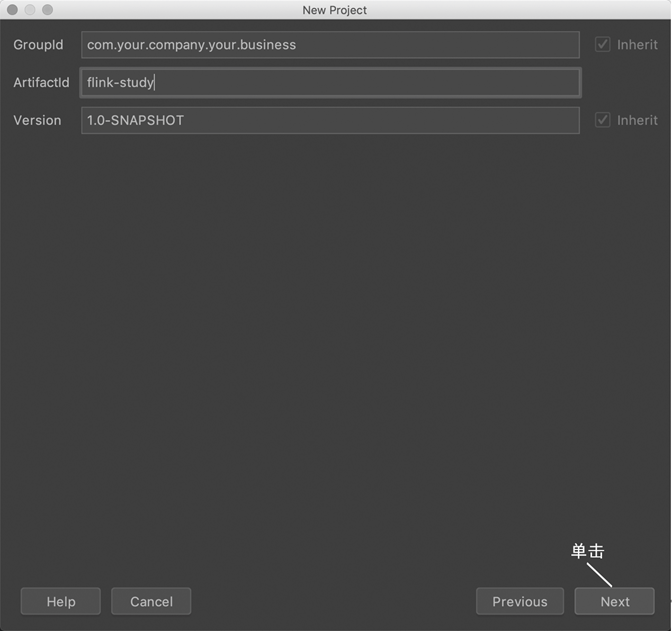
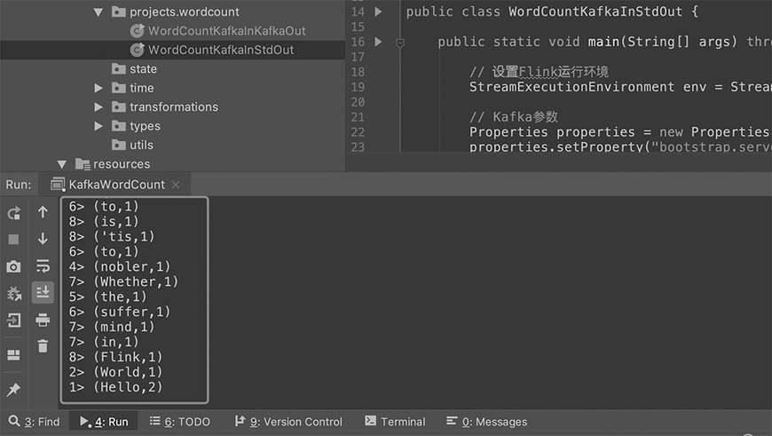

(exercise-Flink-development-environment)=
# 案例实战 Flink开发环境搭建

本案例实战主要带领读者完成对Flink开发环境的搭建。

## 2.4.1 准备所需软件

在1.7节中我们简单提到了Kafka的安装部署所需的软件环境，这里我们再次梳理一下Flink开发所需的软件环境。

1. **操作系统**
   - 目前，我们可以在Linux、macOS和Windows操作系统上开发和运行Flink。类UNIX操作系统（Linux或macOS）是大数据首选的操作系统，它们对Flink的支持更好，适合进行Flink学习和开发。后文会假设读者已经拥有了一个类UNIX操作系统。Windows用户为了构建一个类UNIX环境，可以使用专门为Linux操作系统打造的子系统（Windows subsystem for Linux，即WSL）或者是Cygwin，又或者创建一个虚拟机，在虚拟机中安装Linux操作系统。

2. **JDK**
   - 和Kafka一样，Flink开发基于JDK，因此也需要提前安装好JDK 1.8+ （Java 8或更高的版本），配置好Java环境变量。

3. **其他工具**
   - 其他的工具因开发者习惯不同来安装，不是Flink开发所必需的，但这里仍然建议提前安装好以下工具。
     - **Apache Maven 3.0+**
       - Apache Maven是一个项目管理工具，可以对Java或Scala项目进行构建及依赖管理，是进行大数据开发必备的工具。这里推荐使用Maven是因为Flink源码工程和本书的示例代码工程均使用Maven进行管理。
     - **IntelliJ IDEA**
       - IntelliJ IDEA是一个非常强大的编辑器和开发工具，内置了Maven等一系列工具，是大数据开发必不可少的利器。Intellij IDEA本来是一个商业软件，它提供了社区免费版本，免费版本已经基本能满足绝大多数的开发需求。
       - 除IntelliJ IDEA之外，还有Eclipse IDE或NetBeans IDE等开发工具，读者可以根据自己的使用习惯选择。由于IntelliJ IDEA对Scala的支持更好，本书建议读者使用IntelliJ IDEA。

## 2.4.2 下载并安装Flink

从Flink官网下载编译好的Flink程序，把下载的.tgz压缩包放在你想放置的目录。在下载时，Flink提供了不同的选项，包括Scala 2.11、Scala 2.12、源码版等。其中，前两个版本是Flink官方提供的可执行版，解压后可直接使用，无须从源码开始编译打包。Scala不同版本间兼容性较差，对于Scala开发者来说，需要选择自己常用的版本，对于Java开发者来说，选择哪个Scala版本区别不大。本书写作时，使用的是Flink 1.11和Scala 2.11，读者可以根据自身情况下载相应版本。

按照下面的方式，解压该压缩包，进入解压目录，并启动Flink集群。

```bash
$ tar -zxvf flink-1.11.2-bin-scala_2.11.tgz  # 解压
$ cd flink-1.11.2-bin-scala_2.11  # 进入解压目录
$ ./bin/start-cluster.sh  # 启动 Flink 集群
```

成功启动后，打开浏览器，输入`http://localhost:8081`，可以进入Flink集群的仪表盘（WebUI），如图2-4所示。Flink WebUI可以对Flink集群进行管理和监控。



## 2.4.3 创建Flink工程

我们使用Maven从零开始创建一个Flink工程。

```bash
$ mvn archetype:generate \
    -DarchetypeGroupId=org.apache.flink \
    -DarchetypeArtifactId=flink-quickstart-java \
    -DarchetypeVersion=1.11.2 \
    -DgroupId=com.myflink \
    -DartifactId=flink-study-scala \
    -Dversion=0.1 \
    -Dpackage=quickstart \
    -DinteractiveMode=false
```

archetype是Maven提供的一种项目模板，是别人提前准备好了的项目的结构框架，用户只需要使用Maven工具下载这个模板，在这个模板的基础上丰富并完善代码逻辑。主流框架一般都准备好了archetype，如Spring、Hadoop等。

不熟悉Maven的读者可以先使用IntelliJ IDEA内置的Maven工具，熟悉Maven的读者可直接跳过这部分。

如图2-5所示，在IntelliJ IDEA里依次单击“File”→“New”→“Project”，创建一个新工程。



如图2-6所示，选择左侧的“Maven”，并勾选“Create from archetype”，并单击右侧的“Add Archetype”按钮。



如图2-7所示，在弹出的窗口中填写archetype信息。其中GroupId为org.apache.flink，ArtifactId为flink-quickstart-java，Version为1.11.2，然后单击“OK”。这里主要是告诉Maven去资源库中下载哪个版本的模板。随着Flink的迭代开发，Version也在不断更新，读者可以在Flink的Maven资源库中查看最新的版本。GroupId、ArtifactId、Version可以唯一表示一个发布出来的Java程序包。配置好后，单击Next按钮进入下一步。



如图2-8所示，这一步是建立你自己的Maven工程，以区别其他Maven工程，GroupId是你的公司或部门名称（可以随意填写），ArtifactId是工程发布时的Java归档（Java Archive，JAR）包名，Version是工程的版本。这些配置主要用于区别不同公司所发布的不同包，这与Maven和版本控制相关，Maven的教程中都会介绍这些概念，这里不赘述。



接下来可以继续单击“Next”按钮，注意最后一步选择你的工程所在的磁盘位置，单击“Finish”按钮，如图2-9所示。至此，一个Flink模板就下载好了。


工程结构如图2-10所示。左侧的“Project”栏是工程结构，其中src/main/java文件夹是Java代码文件存放位置，src/main/scala是Scala代码文件存放位置。我们可以在StreamingJob这个文件上继续修改，也可以重新创建一个新文件。


注意，开发前要单击右下角的“Import Changes”，让Maven导入所依赖的包。

## 2.4.4 调试和运行Flink程序

我们创建一个新的文件，名为WordCountKafkaInStdOut.java，开始编写第一个Flink程序—流式词频统计（WordCount）程序。这个程序接收一个Kafka文本数据流，进行词频统计，然后输出到标准输出上。这里先不对程序做深入分析，后文中将会做更详细的解释。

首先要设置Flink的运行环境。

```java
// 设置Flink运行环境
StreamExecutionEnvironment env =
StreamExecutionEnvironment.getExecutionEnvironment();
```

设置Kafka相关参数，连接对应的服务器和端口号，读取名为Shakespeare的Topic中的数据源，将数据源命名为stream。

```java
// Kafka参数
Properties properties = new Properties();
properties.setProperty("bootstrap.servers", "localhost:9092");
properties.setProperty("group.id", "flink-group");
String inputTopic = "Shakespeare";
// Source
FlinkKafkaConsumer<String> consumer =
                new FlinkKafkaConsumer<String>(inputTopic, new SimpleStringSchema(), properties);
DataStream<String> stream = env.addSource(consumer);
```

使用Flink API处理这个数据流。

```java
// Transformation
// 使用Flink API对输入流的文本进行操作
// 切词转换、分组、设置时间窗口、聚合
DataStream<Tuple2<String, Integer>> wordCount = stream
    .flatMap((String line, Collector<Tuple2<String, Integer>> collector) -> {
      String[] tokens = line.split("\\s");
      // 输出结果
      for (String token : tokens) {
        if (token.length() > 0) {
          collector.collect(new Tuple2<>(token, 1));
        }
      }
    })
    .returns(Types.TUPLE(Types.STRING, Types.INT))
    .keyBy(0)
    .timeWindow(Time.seconds(5))
    .sum(1);
```

将数据流输出。

```java
// Sink
wordCount.print();
```

最后运行该程序。

```java
// execute
env.execute("kafka streaming word count");
```

env.execute() 是启动Flink作业所必需的，只有在execute()方法被调用时，之前调用的各个操作才会被提交到集群上或本地计算机上运行。

该程序的完整代码如代码清单2-9所示。

```java
import org.apache.flink.api.common.serialization.SimpleStringSchema;
import org.apache.flink.api.common.typeinfo.Types;
import org.apache.flink.api.java.tuple.Tuple2;
import org.apache.flink.streaming.api.datastream.DataStream;
import org.apache.flink.streaming.api.environment.StreamExecutionEnvironment;
import org.apache.flink.streaming.api.windowing.time.Time;
import org.apache.flink.streaming.connectors.kafka.FlinkKafkaConsumer;
import org.apache.flink.util.Collector;

import java.util.Properties;

public class WordCountKafkaInStdOut {

    public static void main(String[] args) throws Exception {

        // 设置Flink执行环境
        StreamExecutionEnvironment env =
StreamExecutionEnvironment.getExecutionEnvironment();

        // Kafka参数
        Properties properties = new Properties();
        properties.setProperty("bootstrap.servers", "localhost:9092");
        properties.setProperty("group.id", "flink-group");
        String inputTopic = "Shakespeare";
        String outputTopic = "WordCount";

        // Source
        FlinkKafkaConsumer<String> consumer =
                new FlinkKafkaConsumer<String>(inputTopic, new SimpleStringSchema(), properties);
        DataStream<String> stream = env.addSource(consumer);

        // Transformation
        // 使用Flink API对输入流的文本进行操作
        // 按空格切词、计数、分区、设置时间窗口、聚合
        DataStream<Tuple2<String, Integer>> wordCount = stream
            .flatMap((String line, Collector<Tuple2<String, Integer>> collector) -> {
                String[] tokens = line.split("\\s");
                // 输出结果
                for (String token : tokens) {
                    if (token.length() > 0) {
                        collector.collect(new Tuple2<>(token, 1));
                    }
                }
            })
            .returns(Types.TUPLE(Types.STRING, Types.INT))
            .keyBy(0)
            .timeWindow(Time.seconds(5))
            .sum(1);

        // Sink
        wordCount.print();

        // execute
        env.execute("kafka streaming word count");

    }
}
```

代码写完后，我们还要在Maven的项目对象模型（Project Object Model，POM）文件中引入下面的依赖，让Maven可以引用Kafka。

```xml
<dependency>
  <groupId>org.apache.flink</groupId>
  <artifactId>flink-connector-kafka_${scala.binary.version}</artifactId>
  <version>${flink.version}</version>
</dependency>
```

其中，`${scala.binary.version}`是所用的Scala版本号，可以是2.11或2.12，`${flink.version}`是所用的Flink的版本号，比如1.11.2。

## 2.4.5 运行程序

我们在1.7节中展示过如何启动一个Kafka集群，并向某个Topic内发送数据流。在本次Flink作业启动之前，我们还要按照1.7节提到的方式启动一个Kafka集群、创建对应的Topic，并向Topic中写入数据。

1. **在IntelliJ IDEA中运行程序**
   - 在IntelliJ IDEA中，单击绿色运行按钮，运行这个程序。图2-11所示的两个绿色运行按钮中的任意一个都可以运行这个程序。
   - IntelliJ IDEA下方的“Run”栏会显示程序的输出，包括本次需要输出的结果，如图2-12所示。




恭喜你，你的第一个Flink程序运行成功！

**提示**

如果在Intellij IDEA中运行程序时遇到`java.lang.NoClassDefFoundError` 报错，这是因为没有把依赖的类都加载进来。在Intellij IDEA中单击“Run”->“Edit configurations...”，在“Use classpath of module”选项上选择当前工程，并且勾选“Include dependencies with‘Provided’ Scope”

2. **向集群提交作业**
   - 目前，我们学会了先下载并启动本地集群，接着在模板的基础上添加代码，并在IntelliJ IDEA中运行程序。而在生产环境中，我们一般需要将代码编译打包，提交到集群上。我们将在第9章详细介绍如何向Flink集群提交作业。
   - 注意，这里涉及两个目录：一个是我们存放刚刚编写代码的工程目录，简称工程目录；另一个是从Flink官网下载解压的Flink主目录，主目录下的bin目录中有Flink提供的命令行工具。
   - 进入工程目录，使用Maven命令行将代码编译打包。

```bash
# 使用Maven命令行将代码编译打包
# 打好的包一般放在工程目录的target目录下
$ mvn clean package
```

回到Flink主目录，使用Flink提供的命令行工具flink，将打包好的作业提交到集群上。命令行的参数--class用来指定哪个主类作为入口。我们之后会介绍命令行的具体使用方法。

```bash
$ bin/flink run --class
com.flink.tutorials.java.api.projects.wordcount.WordCountKafkaInStdOut
/Users/luweizheng/Projects/big-data/flink-tutorials/target/flink-tutorials-0.1.jar
```

如图2-13所示，这时，Flink WebUI上就多了一个Flink作业。


程序的输出会保存到Flink主目录下面的log目录下的.out文件中，可以使用下面的命令查看结果。

```bash
$ tail -f log/flink-*-taskexecutor-*.out
```

必要时，可以使用下面的命令关停本地集群。

```bash
$ ./bin/stop-cluster.sh
```

Flink开发和调试过程中，一般有如下几种方式运行程序。
- 使用IntelliJ IDEA内置的绿色运行按钮。这种方式主要在本地调试时使用。
- 使用Flink提供的命令行工具向集群提交作业，包括Java和Scala程序。这种方式更适合生产环境。
- 使用Flink提供的其他命令行工具，比如针对Scala、Python和SQL的交互式环境。

对于新手，可以先使用IntelliJ IDEA提供的内置运行按钮，熟练后再使用命令行工具。

## 本章小结
本章中，我们回顾了Flink开发经常用到的继承和多态、泛型和函数式编程等概念，在本地搭建了一个Flink集群，创建了第一个Flink工程，并学会了如何运行Flink程序。
